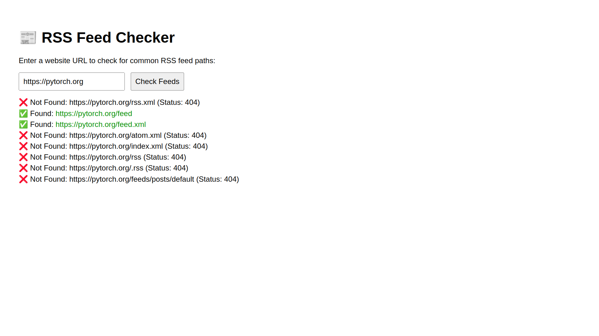

# RSS Finder

A simple html website to find rss feed of a blog more easily

## How to use

- Go to [Github Pages](https://ascodeasice.github.io/rss-finder/)
- Enter a url like [https://pytorch.org](https://pytorch.org)
- Copy the found url to your RSS reader

